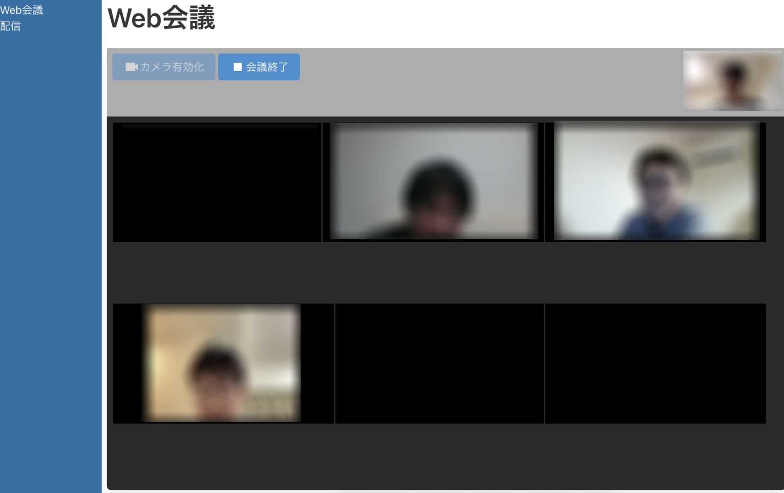

# webrtc-example
- WebRTCのサンプル
- 複数人でWeb会議ができる

  

# アプリ起動
- Node.jsで実行
  ```sh
  npm install
  npm run dev
  ```
- ブラウザで http://localhost:3000 にアクセス
- Node.js(v14)・Chromeで動作確認済み

# 留意点
- localhost以外で実行するには？
  - ブラウザでカメラアクセスするにはSSL化が必要
  - 証明書を用意し、index.tsで証明書パスを指定
    ```ts
    {
        key: fs.readFileSync(os.homedir() + '/cert/private.key'),
        cert: fs.readFileSync(os.homedir() + '/cert/certificate.crt'),
        ca: [fs.readFileSync(os.homedir() + '/cert/ca_bundle.crt')],
    } 
    ```
- インターネット越しでもつながる？
  - 繋がる
  - ネット環境によっては繋がらない場合もある

# データの流れ
- TURNサーバは未使用

  


# その他の説明
- [勉強会資料](documents/marp.pdf)

# 参考にした資料
- [node-webrtc/node-webrtc-examples](https://github.com/node-webrtc/node-webrtc-examples)
- [RTCPeerConnectionを使ってビデオチャットができるまでの流れをまとめてみた](https://www.cyberowl.co.jp/blog/technology/331)
- [WebRTCの裏側にあるNATの話](http://www.slideshare.net/iwashi86/webrtcnat-a-talk-on-nat-behind-webrtc)


