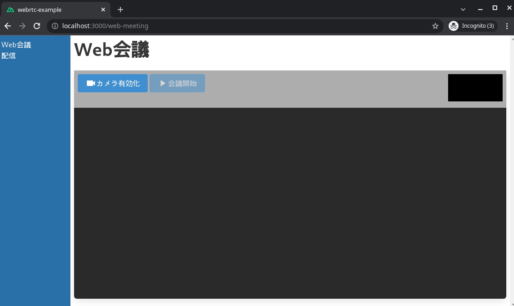

<!-- theme: default -->
<!-- size: 16:9 -->
<!-- paginate: true -->


<!-- タイトルスライド設定 -->
<!-- _class : lead invert-->
<style>
</style>


# WebRTC試してみた
とっしん会
2021/11/17
Kenta

---

## 自己紹介

- Kenta
- 仕事
  - Sier・技術検証
  - Web・チャットボット・IoT
  - 物流関連のSaaS企画中
- 興味
  - WebRTC・Nuxt3・Rust


---

## リモートワークどうですか？

---

<style>
h1 {
    font-size: 100px;
    text-align: right
}
</style>


# 最高だぜ！

---
## 今回はそんな最高な働き方を実現しているWebRTCのお話です

---

## サンプルアプリも作りました


---

## WebRTCとは
- Web Real Time Communication
- Webブラウザーなどを介してビデオ・オーディオ・データをクライアント間でやりとりする規格のこと
- UDP通信を利用
- 自動的に到着したデータ順番を並べ替えたり、ネットワークに応じて送信画素数の調整などをしてくれる

---

## WebRTCの接続パターン
1. プライベートIP接続
    - シンプルなP2P通信
    - 一番安定しているが、同一ネットワークである必要がある
2. STUNサーバを利用した接続（NAT超え接続）
    - STUNサーバという、クライアントのグローバルIPとポートを返却するサーバを利用する
    - クライアント間の接続はP2P接続なのでコストが掛からない
    - NATは個々の環境で差異が大きく、つながらなかった際の原因特定が大変
3. TURNサーバを経由した接続
    - TURNサーバという、送信データを仲介するサーバを利用する
    - 仲介サーバを立てるためコストが大きい
- https://qiita.com/okyk/items/a405f827e23cb9ef3bde
---

## NAT超え接続の仕組み
- UDPホールパンチを利用してNATを超える
  - https://www.slideshare.net/rotsuya/intro-webrtcppt/21
- NATの設定には複数の条件・推奨事項あり
  - https://www.slideshare.net/iwashi86/webrtcnat-a-talk-on-nat-behind-webrtc/19
    ```
    - NATがエンドポイントに依存しないマッピングである必要あり
    - ポート多重はNG
    - マッピングの保存期間は5分以上が推奨
    - ヘアピン接続もサーポート推奨
    - etc...
    ```


---
## 一般的なミーティングツールはどうやって接続してるの？
- P2P通信の出番は少なく、ほとんどがリレーサーバ（TURN）を利用している
  
  - https://xtech.nikkei.com/atcl/nxt/column/18/01497/121100002/
- ZoomはWebRTCを利用していない？
  - WebSocketとWebAssemblyで実現している
  - https://qiita.com/P2eFR6RU/items/66ea83d4b851df4ce37d
---

## WebRTCで実装必要な所①
- SDPの交換
  - SDP（Session Description Protocol）とは
    - 通信するデータの種類（ビデオ・オーディオ）
    - 暗号化の鍵
  - 例（一部抜粋）
    ```
    v=0\r\n' +
    'o=- 5247749264323201101 2 IN IP4 127.0.0.1\r\n' +
    's=-\r\n' +
    't=0 0\r\n' +
    'a=group:BUNDLE 0 1 2\r\n' +
    'a=extmap-allow-mixed\r\n' +
    'a=msid-semantic: WMS OpY32H6GRDLn9t6qhJg7OFmtpknNhrNIqthV\r\n' +
    'm=video 9 UDP/TLS/RTP/SAVPF 96 97 98 99 100 101 102 121 127 120 125 107 108 109 35 36 124 119 123\r\n' +
    ...
    ```
---

## WebRTCで実装必要な所②
- ICE Candidateの交換
  - ICE Candidateとは
    - 通信の際に利用するIPアドレスの候補
    - STUNサーバやTURNサーバを利用して得られるIPアドレスも含む
  - 例
    ```
    {
      candidate: 'candidate:1148888913 1 udp 1685921535 XXX.XXX.XXX.XXX 47799 
      typ srflx raddr XXX.XXX.XXX.XXX rport 47799 generation 0 ufrag 7vwK network-id 1 network-cost 10',
      sdpMid: '2',
      sdpMLineIndex: 2
    }
    ```


---

## セキュリティは？

- ICE Candidate収集
  - もし改ざんされても、P2P通信時に検証できるので問題なし
- SDPやICE Candidateの交換
  - 個々の実装依存

- P2P通信
  - 通信はDTLSで暗号化される（DTLSとはUDP上のTLS）
  - 接続先が問題ないかは、SDPで交換したフィンガープリントとDTLSを通じて交換された証明書が一致しているか確認する

---

## サンプルアプリの構成図
- TURNサーバは未使用


---

## サンプルアプリで試してみよう
- 何人がNATを超えられるかな？


--- 


## その他（接続確認メモ）
- サーバをクライアントと見立て、P2P接続が可能か検証した結果が下記
  - NG: GCP/GAE <=> 我が家Wifi
  - OK: GCP/GAE <=> 自分のモバイル回線
  - OK: GCP/GAE <=> 自分のモバイル回線
  - OK: GCP/GCE <=> 我が家Wifi
- P2P接続時、片側のNAT制限が厳しくなければ接続が可能

---


## その他（開発メモ）
- ブラウザでカメラアクセスするにはSSL化が必要（localhostは例外）
- ZeroSSLならIPで証明書発行が可能（Webからのみ）
  - LetsEncryptだとIPで証明書発行はできない
- GCPのGAE（スタンダード）はWebSocket接続ができない
- GCPのGAEで、Nodejsアプリをコマンドでデプロイするとお金が掛かる（3円/1デプロイ）
  - ソースをNAに送信しビルド → 日本GAEにデプロイ しているため通信費が掛かっている模様


---


<!-- _class : lead invert-->
## Thank you for listening
